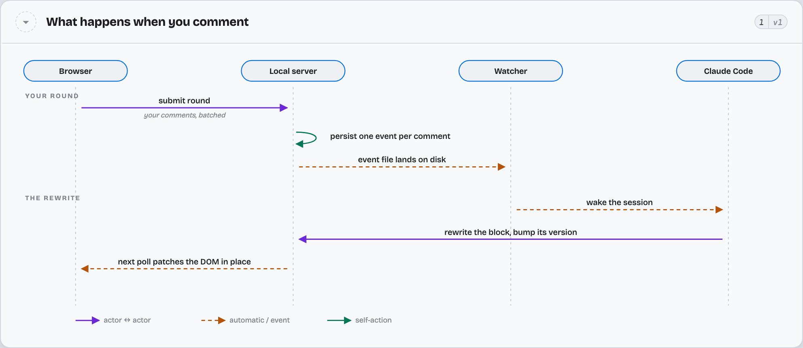
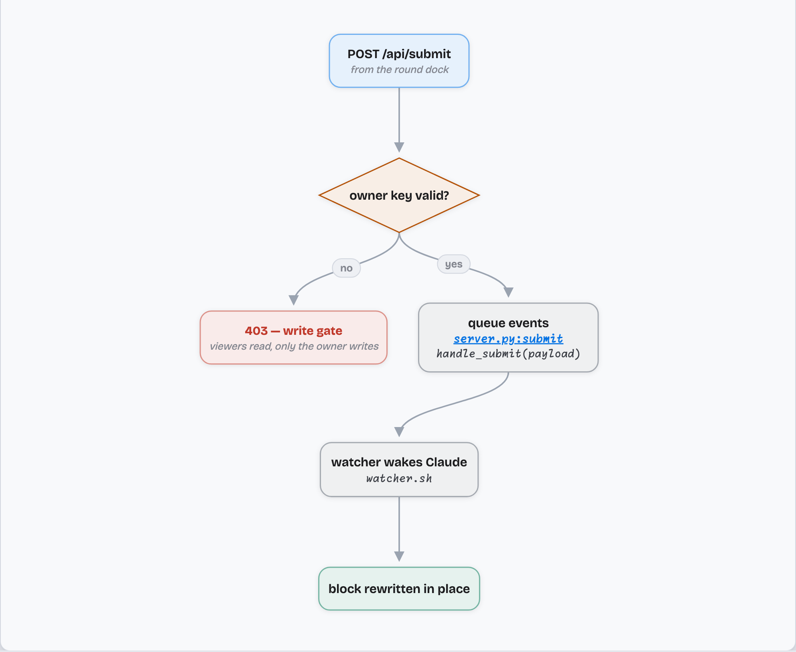
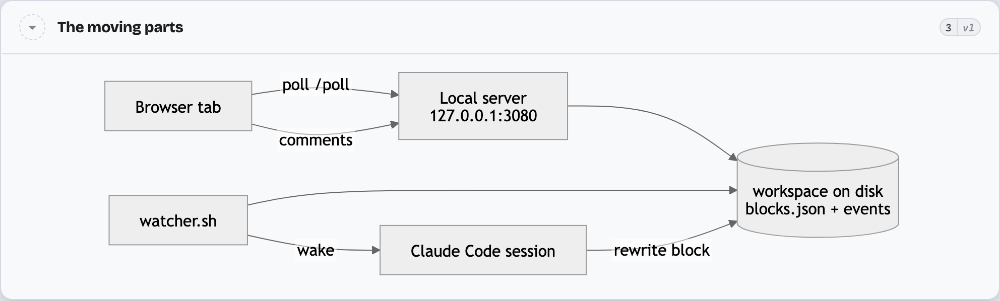
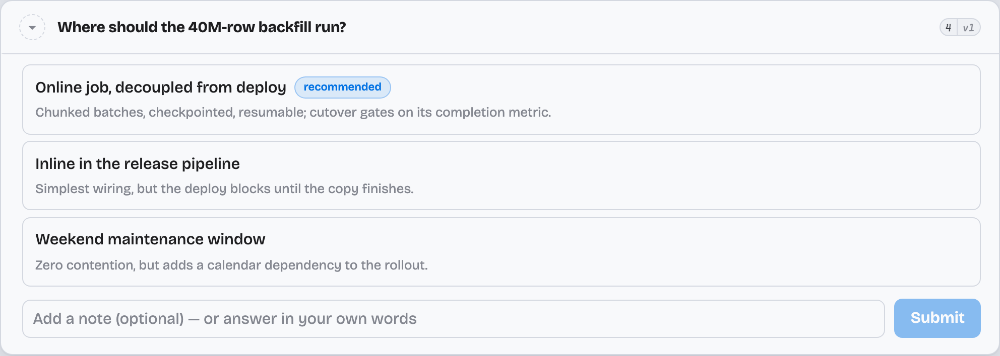
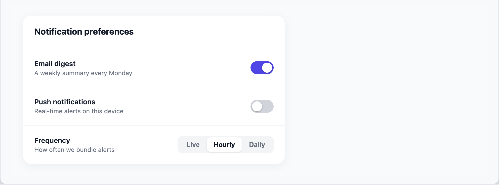

# claude-annotate

Claude writes you a long answer. You read it in a browser instead of a terminal,
click the one paragraph you disagree with, and type why. Claude rewrites *that
block* — not the whole answer, not a fresh reply appended below it.

## Install

    /plugin marketplace add petmakris/claude-annotate

That registers the marketplace, which publishes two plugins. Install either or both:

    /plugin install claude-annotate      # read long answers in a browser, comment on any block
    /plugin install claude-ide-review    # ask questions on a PR diff line or walkthrough step, in IntelliJ

`claude-ide-review` also needs the IntelliJ half, which is a separate download —
grab the `.zip` from [Releases](https://github.com/petmakris/claude-annotate/releases)
and install it via **Settings → Plugins → ⚙ → Install Plugin from Disk…**

Both plugins drive the same local server engine, which lives once in this repository at
`skills/_shared/web_companion/`.

## Use

Ask for something long — a migration plan, a critique of a design, a list of
findings. Claude routes answers with several distinct parts through the view on
its own. To push an answer that has already landed:

    /annotate

Your browser opens. Every block is clickable. Comment on one, and Claude's reply
replaces it in place; the rest of the page does not move or reload.

## Not just prose

Claude splits each answer into blocks and picks a kind per block — a decision
becomes clickable cards, a protocol becomes a sequence diagram, a UI idea
becomes a working mock. Every kind below is commentable, and Claude rewrites
the one you flag.

### Sequence diagrams

Rendered by the plugin's own SVG layout engine — actors, phases, and three
arrow types. Click any line to comment on **the step it draws**, not the whole
diagram, and Claude redraws the flow.

### Flowcharts

Structured nodes with roles that drive shape and color — entry, decision,
success, error — plus `Class:line` references that jump to the source. Nodes
take comments individually. Claude can also emit the flow as restricted Python
(`spec.source`), so you get a *line* to comment on when you want the logic
changed.

### Mermaid diagrams

Architecture, state machines, ER, class diagrams — raw Mermaid source,
rendered to SVG on the server and themed to the page.

### Choice cards

When Claude reaches a genuine fork it asks with cards instead of prose: pick
one, add a note to your pick — or answer note-only, which means "none of
these, here's my direction" and makes Claude re-propose.

### Interactive mockups

Real HTML with working `<style>` and `<script>`, sandboxed in an iframe — the
toggles toggle. Tag regions with `data-annotate-id` and comments can target
the sidebar or one settings row instead of the whole mock.

### The reading machinery around them

- **Rounds** — comments batch into one explicit submit, so Claude wakes once
  per review pass, not once per thought.
- **Four verdicts per block** — comment, *delete*, *keep as written*, or
  *compact* (fold its point into what stays). A whole review, not just margin
  notes.
- **Versions and diffs** — every rewrite bumps the block's version chip;
  "what changed" shows the diff, and older versions stay a click away.
- **Voice dictation** — dictate comments straight into the comment box
  (works on `localhost`, where the browser grants a secure context).
- **Fuzzy search** — filter a long answer down to the blocks that mention
  the thing you're looking for.
- **Paste images** — screenshots paste into comments and travel to Claude
  with the round.
- **Persistent workspaces** — documents live on disk for 7 days; close the
  tab, come back, the comment history is still there. The server's landing
  page lists every live workspace, and `/annotate resume <slug>` reattaches
  Claude to one.

## How it works

A local HTTP server renders the response as addressable blocks, and the page
polls it for changes. Your comment becomes an event; Claude wakes, rewrites that
block, and the next poll picks it up. Sessions persist on disk, so you can close
the tab and come back to a document with its comment history intact.

The server binds to `127.0.0.1` on a port chosen at startup and records it in
`~/.claude/annotate/server.json`.

Voice dictation needs a secure browser context, so it works on `localhost` and
not over a LAN hostname.

## Related

Both plugins drive the same local server engine. The engine lives here in
`skills/_shared/web_companion/` and is edited in place. The separate repositories
[web-companion](https://github.com/petmakris/web-companion) and
[claude-ide-review](https://github.com/petmakris/claude-ide-review) are superseded
by this repository; they are kept for their history only.

## License

MIT
