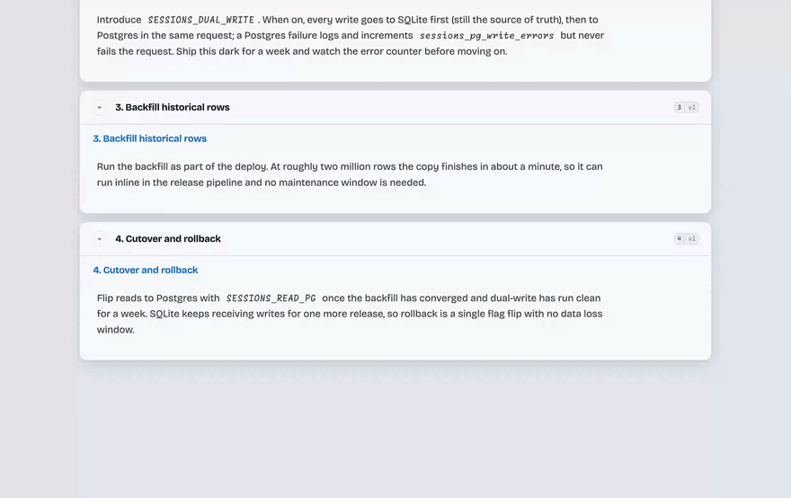
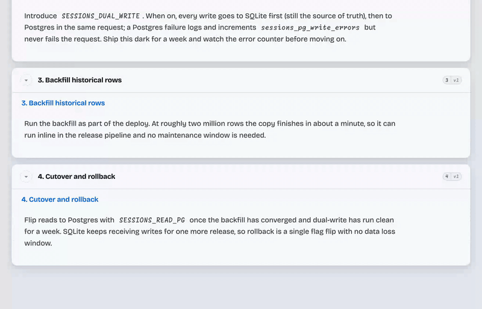

# claude-annotate

Claude writes you a long answer. You read it in a browser instead of a terminal,
click the one paragraph you disagree with, and type why. Claude rewrites *that
block* — not the whole answer, not a fresh reply appended below it.

## Install

    /plugin marketplace add petmakris/claude-annotate

That registers the marketplace, which publishes two plugins. Install either or both:

    /plugin install claude-annotate      # read long answers in a browser, comment on any block
    /plugin install claude-ide-review    # ask questions on a PR diff line or walkthrough step, in IntelliJ

`claude-ide-review` also needs the IntelliJ half, which is a separate download —
grab the `.zip` from [Releases](https://github.com/petmakris/claude-annotate/releases)
and install it via **Settings → Plugins → ⚙ → Install Plugin from Disk…**

Both plugins drive the same local server engine, which lives once in this repository at
`skills/_shared/web_companion/`.

## Use

Ask for something long — a migration plan, a critique of a design, a list of
findings. Claude routes answers with several distinct parts through the view on
its own. To push an answer that has already landed:

    /annotate

Your browser opens. Every block is clickable. Comment on one, and Claude's reply
replaces it in place; the rest of the page does not move or reload.

## How it works

A local HTTP server renders the response as addressable blocks, and the page
polls it for changes. Your comment becomes an event; Claude wakes, rewrites that
block, and the next poll picks it up. Sessions persist on disk, so you can close
the tab and come back to a document with its comment history intact.

The server binds to `127.0.0.1` on a port chosen at startup and records it in
`~/.claude/annotate/server.json`.

Voice dictation needs a secure browser context, so it works on `localhost` and
not over a LAN hostname.

## Related

Both plugins drive the same local server engine. The engine lives here in
`skills/_shared/web_companion/` and is edited in place. The separate repositories
[web-companion](https://github.com/petmakris/web-companion) and
[claude-ide-review](https://github.com/petmakris/claude-ide-review) are superseded
by this repository; they are kept for their history only.

## License

MIT
