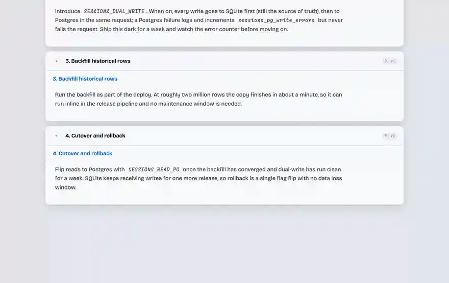
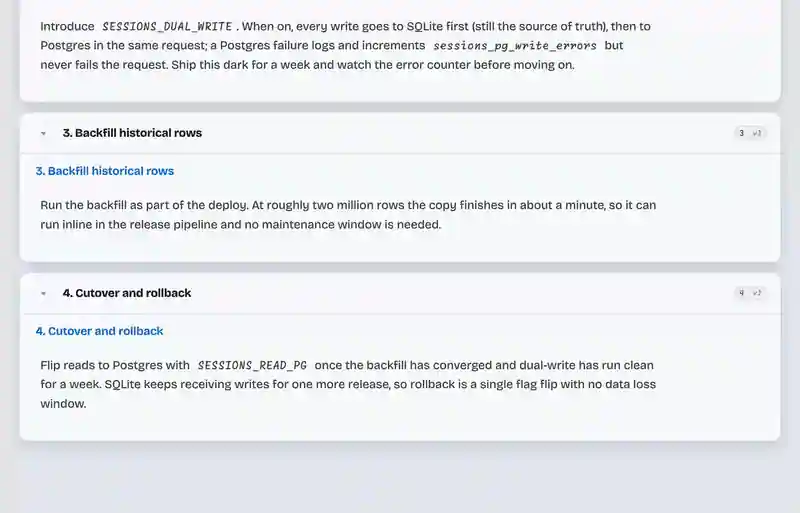
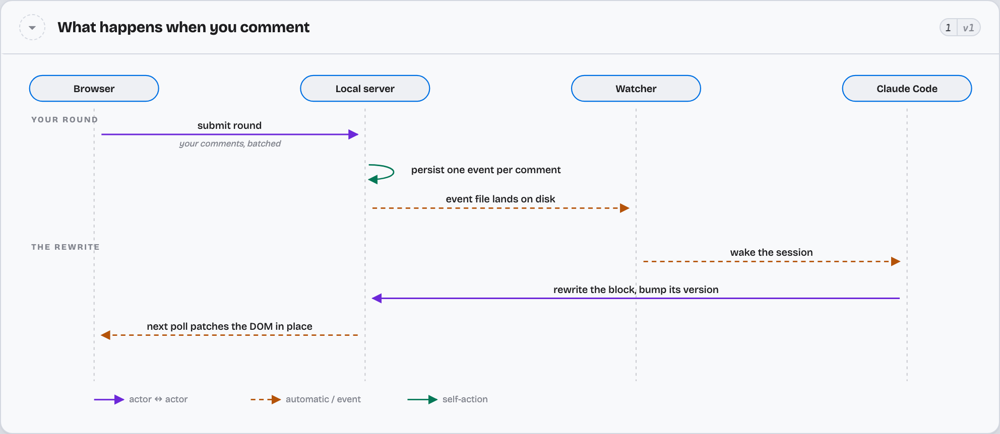
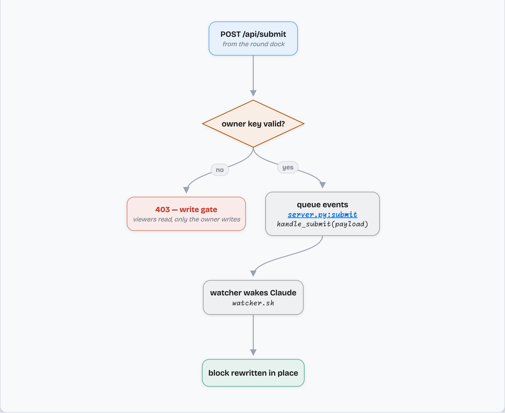
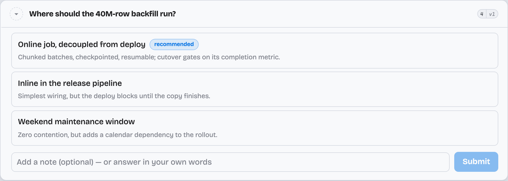
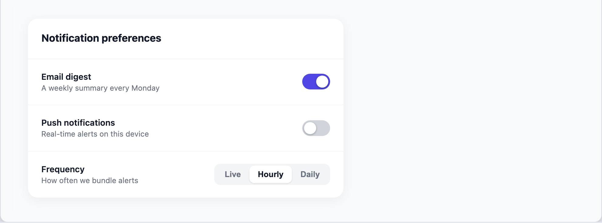

# claude-annotate

Claude writes you a long answer. You read it in a browser instead of a terminal,
click the one paragraph you disagree with, and type why. Claude rewrites *that
block* — not the whole answer, not a fresh reply appended below it.

## Requirements

- **`python3` on your `PATH`, version 3.9 or newer.** Standard library only —
  there is nothing to `pip install`.
- **`bash` and `curl`** (both ship with macOS and every mainstream Linux).
- **macOS or Linux.** Windows is not supported.
- **`node`** — runs the ELK layout engine behind the flowchart layout
  switcher. Without it, `kind: "flowchart"` blocks still render, but fall
  back to the simpler grid layout and ship no layout control.
- `claude-ide-review` additionally needs an IDE half — the IntelliJ plugin for
  `/ask-diff` and `/walkthrough`, the VS Code extension for `/show-diff` — see
  below.

On a fresh Mac without the Xcode Command Line Tools there is no `python3` at
all; `xcode-select --install` or `brew install python` provides one. If
anything misbehaves after installing, run `/annotate-doctor` for a check of
your machine.

## Install

    /plugin marketplace add petmakris/claude-annotate

That registers the marketplace, which publishes two plugins. Install either or both:

    /plugin install claude-annotate      # comment on a long answer, build and review slide decks, draw a feature's
                                         # data flow, or see one Java object filled with real values
    /plugin install claude-ide-review    # ask questions on a PR diff line or walkthrough step in IntelliJ,
                                         # or open any diff in VS Code and ask on its lines (show-diff)

`claude-ide-review` also needs the IDE half for whichever editor you use, each a
separate install:

- **IntelliJ**, for `/ask-diff` and `/walkthrough` — grab the `.zip` from
  [Releases](https://github.com/petmakris/claude-annotate/releases) and install
  it via **Settings → Plugins → ⚙ → Install Plugin from Disk…**
- **VS Code**, for `/show-diff` — the `petros-makris.petros-makris-vscode`
  extension, built from `vscode-plugin/` and installed with
  `vscode-plugin/install.sh --build` (it runs `build.sh`, then
  `code --install-extension` on the `.vsix` it produces).
  `/show-diff` drives nothing else.

Seven skills — `annotate`, `deck`, `dataflow`, `specimen`, `walkthrough`,
`ask_diff` and `show-diff` — push to the same **webcompanion daemon**, a
standalone service installed separately from its own repository (`pipx install
webcompanion && webcompanion install-service`; see [Related](#related)) — not
something this repository runs. `show-diff` degrades gracefully without it:
diffs still open, only the per-line comment feature is unavailable. The other
six have no server of their own to fall back to (`dataflow`'s field view is the
one part of them that never needs it). `slides` does not use the daemon, and
`annotate-doctor` only checks it.

## Which diff tool, when

Six things in this setup can put a diff in front of you, and they used to be told apart
only by which one you happened to remember. They are told apart by two questions now:
which two commits, and can you type into the result.

The left endpoint is one shared ref. `@git pr-base --pin` writes a `pr-base` branch at the
commit your branch forked from, and it does not move when somebody else merges into
master. Everything below resolves that same ref — the IntelliJ key through
`BaseBranchResolver`, `cr -p` through `@git pr-base --sha`, `show-diff` through the base
`wp diffable` reports. Re-pin after a rebase; nothing else moves it.

| Tool | Two commits | Where | Editable |
|------|-------------|-------|----------|
| `cr` | last commit, `N` back, a sha, `a..b`, `-w` worktree vs HEAD | terminal (diffnav), pipeable | no |
| `cr -p` | `pr-base` → worktree | terminal | no |
| ⌥B (IDE plugin) | `pr-base` → the live file | IntelliJ, one file | **yes** |
| ⇧⌘D | `pr-base` → worktree, every file | IntelliJ | **yes** |
| `/show-diff` | any pair, another checkout, a colleague's branch | VS Code, one scroll | **yes** |
| `/ask-diff` | a PR diff snapshot | IntelliJ, threaded | no — it answers questions |

Your own in-progress branch belongs to the IntelliJ keys, because you are already in the
file and the right-hand pane is the file itself. `/show-diff` is for what those keys
cannot reach: another checkout, several at once, a stacked branch's parent, an
`origin/<branch>` this clone has never fetched.

`/ask-diff` was called `/interactive-review` until 2026-09-02, and `cr` fronted
`@git review` until the same day. Neither of them judges a PR — one answers questions
about a diff, the other reads one — so neither kept the word "review".

## Use

Ask for something long — a migration plan, a critique of a design, a list of
findings, then push it into the view:

    /annotate

Your browser opens. Every block is clickable. Comment on one, and Claude's reply
replaces it in place; the rest of the page does not move or reload.

That first `/annotate` also arms the session: from then on every substantive
answer goes to the browser instead of the terminal, until you say "respond in
terminal". Nothing routes there on its own before you ask.

## Decks

`/deck <path to a deck .html>` opens a presentation the same way, except the
document is a file you already own. Every slide renders as itself, in order, at
the size it will be shown. Click any line — a title, a paragraph, a bullet —
say what should change, and Claude edits that line in the file.

The deck is never rewritten wholesale. A comment resolves to a line range, not
to a search string, so an edit is one line in `git diff` and the entities,
attribute case and formatting everywhere else survive untouched.

    /deck ~/decks/2026-quarterly-review

A folder resolves to the `.html` inside it with the same name.

## Not just prose

Claude splits each answer into blocks and picks a kind per block — a decision
becomes clickable cards, a protocol becomes a sequence diagram, a UI idea
becomes a working mock. Every kind below is commentable, and Claude rewrites
the one you flag.

### Sequence diagrams

Rendered by the plugin's own SVG layout engine — actors, phases, and three
arrow types. Click any line to comment on **the step it draws**, not the whole
diagram, and Claude redraws the flow.

### Flowcharts

Structured nodes with roles that drive shape and color — entry, decision,
success, error — plus `Class:line` references that jump to the source. Nodes
take comments individually. Claude can also emit the flow as restricted Python
(`spec.source`), so you get a *line* to comment on when you want the logic
changed.

### Choice cards

When Claude reaches a genuine fork it asks with cards instead of prose: pick
one, add a note to your pick — or answer note-only, which means "none of
these, here's my direction" and makes Claude re-propose.

### Interactive mockups

Real HTML with working `<style>` and `<script>`, sandboxed in an iframe — the
toggles toggle. Tag regions with `data-annotate-id` and comments can target
the sidebar or one settings row instead of the whole mock.

### The reading machinery around them

- **Rounds** — comments batch into one explicit submit, so Claude wakes once
  per review pass, not once per thought.
- **Four verdicts per block** — comment, *delete*, *keep as written*, or
  *compact* (fold its point into what stays). A whole review, not just margin
  notes.
- **Versions and diffs** — every rewrite bumps the block's version chip;
  "what changed" shows the diff, and older versions stay a click away.
- **Voice dictation** — dictate comments straight into the comment box
  (works on `localhost`, where the browser grants a secure context).
- **Fuzzy search** — filter a long answer down to the blocks that mention
  the thing you're looking for.
- **Paste images** — screenshots paste into comments and travel to Claude
  with the round.
- **Persistent workspaces** — documents live in the webcompanion daemon's
  storage until you delete them; close the tab, come back next month, the
  comment history is still there. The daemon's landing page lists your
  sessions, `/annotate resume <slug>` reattaches Claude to one, and
  `webcompanion forget --sid <sid or slug>` deletes one for good. Workspaces
  are stored centrally, at `~/.claude/webcompanion/workspaces/<kind>/<sid>/`
  (`annotate/` for this skill, beside `deck/`, `dataflow/` and the rest),
  never inside the project they were created from — so deleting a throwaway
  git worktree doesn't take its annotations with it. Nothing expires by
  default; a session left idle for 12 hours is only marked finished. The
  daemon reads no environment variables: `"retention_days": N` in
  `~/.claude/webcompanion/config.json` opts into N-day auto-expiry, and
  `"workspace_root": "/abs/path"` keeps workspaces somewhere else.
  `webcompanion migrate` moves workspaces left under the retired per-skill
  servers' roots into the daemon's.

## How it works

There is no per-response server. Every push renders the response as
addressable items and PATCHes them onto the **webcompanion daemon** — a
separately-installed, always-on service (a different repository,
[webcompanion](https://github.com/petmakris/webcompanion)) shared by every
migrated skill and the IDE plugin. Your comment becomes an event on that
daemon; `webcompanion watch` wakes Claude, Claude rewrites the block and
PATCHes it back, and the page picks up the change over its SSE connection.
Sessions persist in the daemon's own storage, so you can close the tab and
come back to a document with its comment history intact.

The daemon's address and write token live in `~/.claude/webcompanion/config.json`.
Run `/annotate-doctor` to check whether the daemon is installed and running,
or to have it install and start it for you.

Voice dictation needs a secure browser context, so it works on `localhost` and
not over a LAN hostname.

## Related

Seven of the nine skills (`annotate`, `deck`, `dataflow`, `specimen`,
`walkthrough`, `ask_diff`, `show-diff`) push to the same **webcompanion daemon** —
`slides` never does, and `annotate-doctor` only checks it. It is one always-on process
per machine, installed separately (`pipx install webcompanion`) from its own
repository, not something this repository runs. Run `/annotate-doctor` to
check whether it's installed and running, or to have it install and start it
for you.

This repository runs no server of its own. Every skill reaches the daemon
through `skills/_shared/webcompanion_client.py`; `skills/_shared/README.md`
says what else is shared and the rule for what may live there.

The older, similarly-named repositories
[web-companion](https://github.com/petmakris/web-companion) (hyphenated) and
[claude-ide-review](https://github.com/petmakris/claude-ide-review) are superseded
by this repository and kept for their history only — they predate `webcompanion`
above and are unrelated to it.

## License

MIT
